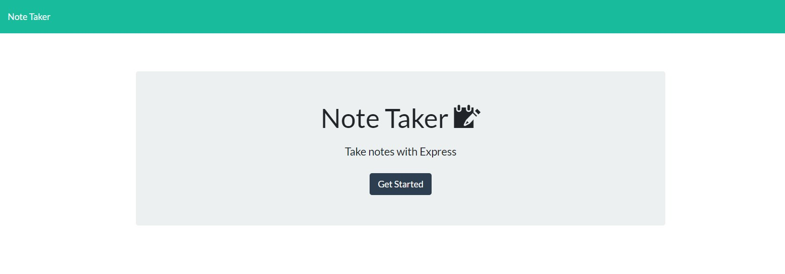
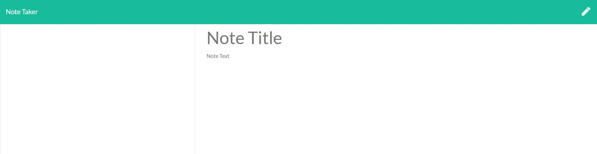
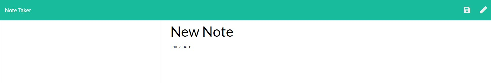
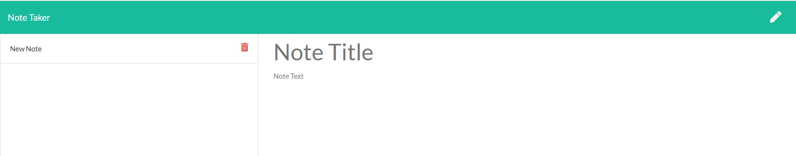

# Note-Taker

## Description

This is a simple application that allows the user to create notes, read notes that have been created, and delete notes that are no longer wanted. Here are some screenshots of how it will look as you go through the application: 

## Usage

Click on the Get Started button. This will take you to the notes page. 

To add a note, enter your title in the field indicated. A note can be entered into the space below. A save icon will appear when both fields have been populated. Saving a note will add it to the db.json file to be recalled later.

To create a new note, either repeat the above process or if you're in the middle of writing a note and want to clear everything for a new note, click on the pen icon at the top right of the page.

Notes that have been written will populate on the lefthand side of the page and clicking on them will bring up the note. There is no edit feature at this time. 

To delete a note, simply click on the trash icon to the right of the desired note's title.

## License

This project is covered under a MIT license. Feel free to use it as you wish.

## Questions

  GitHub User Name: willsan0723

  [GitHub Repository](https://github.com/willsan0723/)

  If you have any additional questions you can reach me at william.santee@gmail.com
